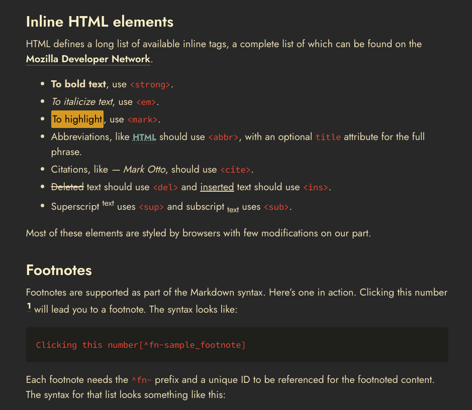
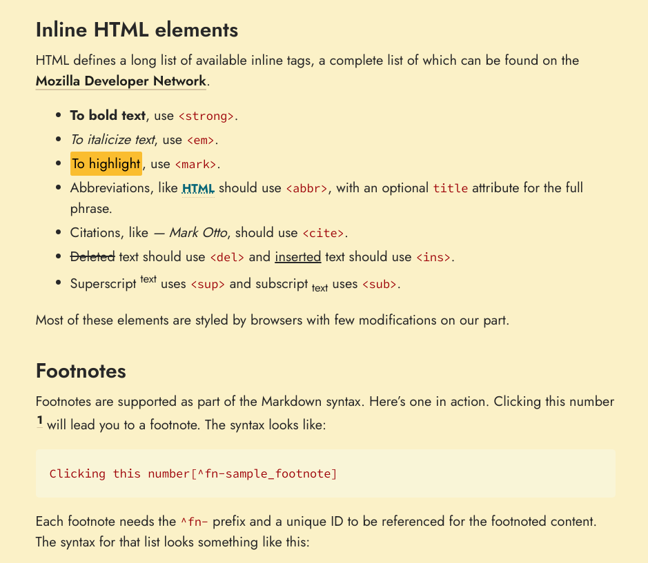

# Gruv Poole

Gruv Poole is a fork of the [Poole theme](https://github.com/poole/poole) for [Jekyll](http://jekyllrb.com), the static site generator. Gruv Poole provides a facelift to the original theme but its philosophy remains the same:
> [Poole] provide[s] a clear and concise foundational setup for any Jekyll site. It does so by furnishing a full vanilla Jekyll install with example layouts, pages, posts, and styles.
[- @mdo](https://markdotto.com/)

Gruv Poole rebuilt Poole's color scheme to implement [Gruvbox's](https://github.com/morhetz/gruvbox) color palette and adds dedicated typefaces.

## Usage

### Install as a Gem

The Gruv Poole theme was intended to be distributed as a [Ruby Gem for Jekyll sites](https://jekyllrb.com/docs/themes/#understanding-gem-based-themes).
In your Jekyll site's code, add the following to your Gemfile:
`gem "jekyll-theme-gruv-poole", "~> 0.9"`
And run `bundle install`. Note that theme development adheres to the [SemVer](https://semver.org/) versioning standard.

### Hacking on theme code

Feel free to tweak this theme to your liking. Pay attention to the `.ruby-version` file for what version of Ruby to use. [rbenv](https://github.com/rbenv/rbenv) is recommended for Ruby development. Once set, then run `bundle install` and then `bundle exec jekyll s` to build and serve the demo theme site. 
Open <http://localhost:4000> in your browser, and voilà.

For further resources (e.g. hosting free site on GitHub Pages, etc) see the original [Poole theme's documentation](https://github.com/poole/poole).

## Licenses

Open sourced under the [MIT license](LICENSE.md). Fonts are both licensed under the [SIL Open Font License](https://openfontlicense.org/). Their licenses can be found [here](assets/fonts/body/LICENSE.md) and [here](assets/fonts/code/LICENSE.md).
