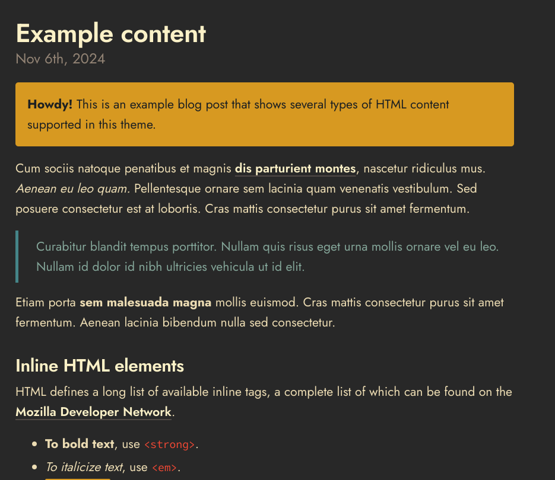

# Gruv Poole

Gruv Poole is a modern, WCAG-compliant fork of the [Poole theme](https://github.com/poole/poole) for [Jekyll](http://jekyllrb.com), the static site generator.

Poole's bones serve as the foundation, and Gruv Poole revamps the muscle, connective tissue and skin:
- implements the retro groove color palette from the Vim [Gruvbox theme](https://github.com/morhetz/gruvbox)
- complies with the [WCAG 2.2 AA accessibility standard](https://www.wcag.com/resource/what-is-wcag)
- adds dedicated [open source typefaces](#licenses)
- adds a responsive two-column [home layout](#home-page-content) with overridable main content and social links
- adds dynamic privacy policy based on your [Google Analytics configuration](#privacy-and-google-analytics)
- removes paginator plugin in favor of adding ability to create [nav items in the masthead](#masthead-navigation)
- removes RSS and SEO plugins and replaces with configurable behavior
- refactors stylesheets to be more focused

Gruv Poole still aims to adhere to [@mdo's](https://github.com/mdo) philosophy of the original theme:
> [To] provide a clear and concise foundational setup for any Jekyll site. It does so by furnishing a full vanilla Jekyll install with example layouts, pages, posts, and styles.

Have questions or suggestions? Feel free to [open an issue on GitHub](https://github.com/jamogriff/gruv-poole/issues/new).

## Contents

- [Screenshots](#screenshots)
- [Usage](#usage)
- [Theme Overview](#theme-overview)
- [Configuration Options](#configuration-options)
- [Licenses](#licenses)

## Screenshots

### Dark Mode



> Dark mode is enabled automatically via [CSS media query](https://developer.mozilla.org/en-US/docs/Web/CSS/@media/prefers-color-scheme) dependent on what the user's system preference is set as.

### Light Mode


## Usage

### Option 1: Install as a Gem

The Gruv Poole theme was intended to be distributed as a [Ruby Gem for Jekyll sites](https://jekyllrb.com/docs/themes/#understanding-gem-based-themes).
In your Jekyll site's code, add the following to your Gemfile:
`gem "jekyll-theme-gruv-poole"`

Add the following line to your site's `_config.yml`:
```yaml
theme: jekyll-theme-gruv-poole
```

Ensure that you have your `_config.yml` with the data necessary to build the theme (see [Configuration Options](#configuration-options)) and then run `bundle` and `jekyll s`.

### Option 2: Hacking on theme code

Feel free to tweak this theme to your liking. Pay attention to the `.ruby-version` file for what version of Ruby to use-- [rbenv](https://github.com/rbenv/rbenv) is recommended for Ruby development.

Once Ruby version is set, then run `bundle install` and then `bundle exec jekyll s` to build and serve the demo theme site. Please note this theme's [Configuration Options](#configuration-options)).
Open <http://localhost:4000> in your browser, and voilà.

## Theme Overview

### Site structure (HTML)

The files within the `_layouts` directory define the HTML structure of pages and posts on the site. `_layouts/base.html` is the base HTML of the theme, which all other layouts should extend from.

Re-usable snippets of HTML code--also known as partials-- are placed in the `_includes` directory. 

### Site styling (Sass/CSS)

All of the site's styling resides in the `_sass` directory. The most noteworthy being `_variables.scss`, where CSS variables can be quickly tweaked to change the look and feel of the theme.

The theme's main style file that ultimately gets imported to the site's base HTML layout is `/assets/main.scss`. This `main.scss` file imports all of the Sass files in the `_sass` directory and Jekyll's Sass compilation outputs a single `main.css` similar to Webpack.

## Configuration Options

All the options and content in this section are configured in your site's `_config.yml` file. Note that [YAML](https://yaml.org/) syntax is very specific about spacing.

The following properties should be considered required and are typical of a Jekyll theme:
```yaml
title: Gruv Poole
tagline: Gruvbox Jekyll theme
description: This description will be used in meta tags for SEO and displayed on the homepage
```

### Home page content

Gruv Poole's home page layout features an abbreviated about section with social links and a main content area.

#### About section

These are optional, but the theme was designed to render them.

```yaml
about:
  image:
    src: demo-assets/jamo.jpg
    alt: Image of Jamogriff
  # You can add more links here, but icons are only available
  # for these platforms specifically
  socials:
    - { id: github, url: https://github.com/jamogriff }
    - { id: youtube, url: https://github.com/jamogriff }
    - { id: linkedin, url: https://github.com/jamogriff }
    - { id: facebook, url: https://github.com/jamogriff }
    - { id: instagram, url: https://github.com/jamogriff }
    - { id: reddit, url: https://github.com/jamogriff }
    - { id: tiktok, url: https://github.com/jamogriff }
    - { id: x, url: https://github.com/jamogriff }
```

Additionally the theme also supports advertising an RSS feed. Gruv Poole itself **does not** generate an RSS feed by default (see [jekyll-feed plugin](https://github.com/jekyll/jekyll-feed)); however, it will include a link with RSS icon in the social links area if you add the feed's path in your config:
```yaml
rss_feed: feed.xml
```

#### Main section

By default a post archive is displayed as the main content, but this can easily be overridden to be anything you want. To override this content you can add whatever HTML you want in a page that implements the `home` layout.

### Masthead navigation

You may add a couple of pages to be displayed as links in the navbar section of the site's masthead:
```yaml
masthead_pages:
  - about.md
```

### Privacy and Google Analytics

Gruv Poole includes a dynamic privacy policy layout (`privacy-policy`) **that you must implement in a page on your site.** The layout will display a privacy policy dependant on whether Google Analytics is enabled on your site.

To enable Google Analytics, add the following lines to your Jekyll site's `_config.yml`:

```yaml
google_analytics: UA-NNNNNNNN-N
```

Note that Google Analytics will only be enabled in production (i.e. adding `JEKYLL_ENV=production` [when building](https://jekyllrb.com/docs/configuration/environments/) the site).

### SEO

Gruv Poole offers a very simple implementation of SEO that only targets the [description meta tag](https://developers.google.com/search/docs/crawling-indexing/special-tags). You are encouraged to add a `description` to the front matter of posts and pages to leverage this. Otherwise, the site description is used by default.

If you want to opt out of this behavior (e.g. you want to use an SEO plugin), then add the following to your config:
```yaml
disable_simple_seo: true
```

## Licenses

Open sourced under the [MIT license](LICENSE.md). Fonts are both licensed under the [SIL Open Font License](https://openfontlicense.org/). Their licenses can be found [here](assets/fonts/body/LICENSE.md) and [here](assets/fonts/code/LICENSE.md).

---

For further resources (e.g. hosting free site on GitHub Pages, etc) see the original [Poole theme's documentation](https://github.com/poole/poole).
